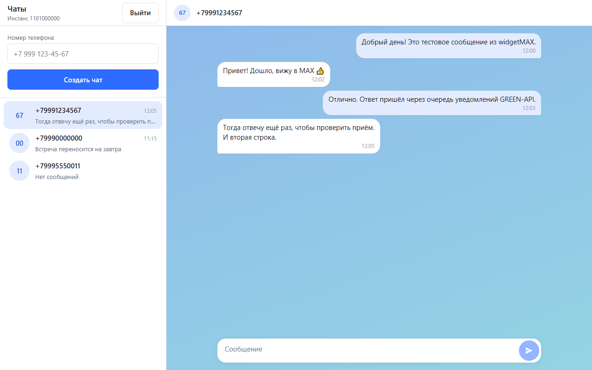
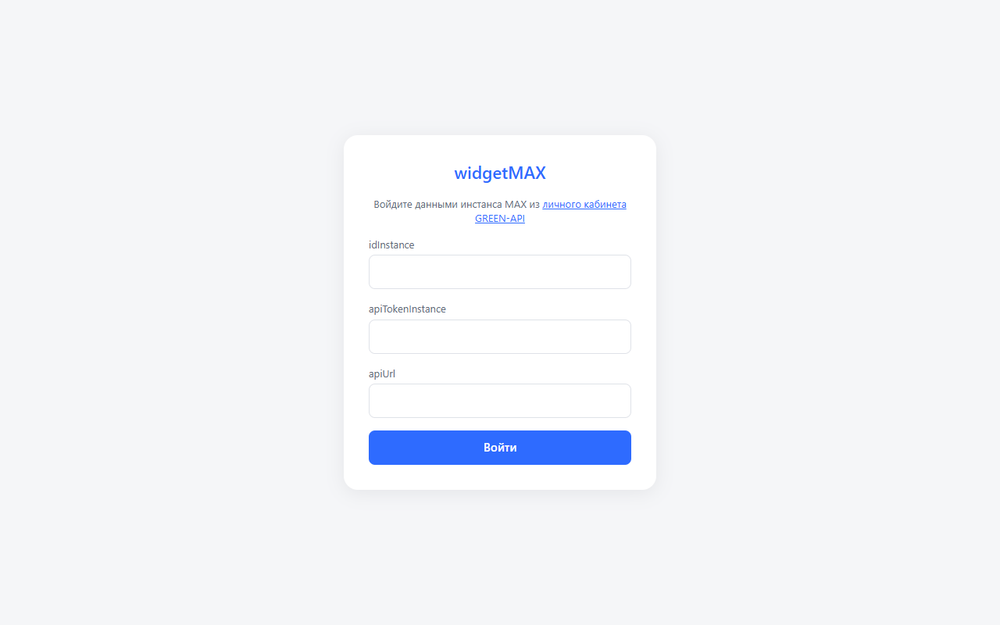
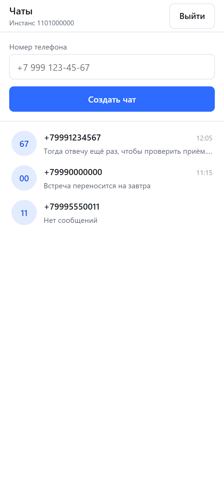
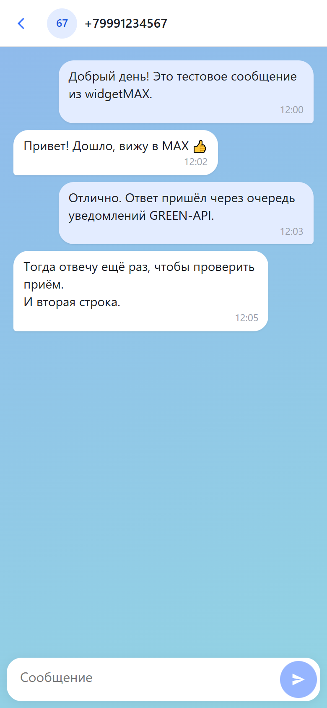

# widgetMAX

Веб-чат для отправки и получения текстовых сообщений в мессенджере [MAX](https://max.ru/) через
[GREEN-API](https://green-api.com/max). Внешний вид — по образцу https://web.max.ru/.

Тестовое задание «Фронтенд-разработчик React». Бэкенда нет: приложение обращается к GREEN-API
напрямую из браузера.

**Демо:** https://dmitriybratishchev.github.io/widgetMAX/ — войти можно данными своего инстанса
GREEN-API (см. [«Что нужно от GREEN-API»](#что-нужно-от-green-api)).



## Стек

React 19, TypeScript, Vite, TanStack Query, Zustand, SCSS-модули, Vitest + React Testing Library,
oxlint, Prettier.

## Локальный запуск

Нужен Node.js **22.12** или новее.

```bash
npm install
npm run dev
```

Приложение откроется на http://localhost:5173.

## Скрипты

| Команда                | Что делает                                   |
| ---------------------- | -------------------------------------------- |
| `npm run dev`          | dev-сервер Vite                              |
| `npm run build`        | проверка типов и production-сборка в `dist/` |
| `npm run preview`      | локальный просмотр собранного `dist/`        |
| `npm run lint`         | линтер (oxlint)                              |
| `npm run format`       | форматирование Prettier                      |
| `npm run format:check` | проверка форматирования                      |
| `npm test`             | тесты в watch-режиме                         |
| `npm run test:run`     | однократный прогон тестов                    |

## Что нужно от GREEN-API

1. Зарегистрироваться в [личном кабинете](https://console.green-api.com/) и создать инстанс
   **MAX** (тариф Developer бесплатный).
2. Авторизовать инстанс: в кабинете «Получить QR-код», в приложении MAX — «Профиль → Устройства →
   Войти по QR-коду». Пароль входа в MAX должен быть отключён.
3. В настройках инстанса, блок «Уведомления»:
   - «Адрес отправки уведомлений (URL)» оставить **пустым** — иначе уведомления уходят на этот адрес,
     а приложение их не получит;
   - включить **«Получать уведомления о входящих сообщениях и файлах»** — без него ответы собеседника
     в чат не придут. У нового инстанса MAX все уведомления **выключены**;
   - по желанию — «…о сообщениях, отправленных с телефона» (в чате видно, что вы написали из
     приложения MAX). Остальные переключатели не нужны.

   Нажать «Сохранить изменения» и подождать около минуты.

4. Скопировать из кабинета `idInstance`, `apiTokenInstance` и `apiUrl` — их вводят на экране входа
   приложения.

Учётные данные вводятся только в интерфейсе: в коде, `.env` и репозитории их нет.

## Как пользоваться

1. На экране входа ввести `idInstance` и `apiTokenInstance` — `apiUrl` подставится сам.
2. Слева ввести номер получателя в любом виде (`+7 999 123-45-67`, `8 999 123 45 67`) и нажать
   «Создать чат». Приложение проверит номер через `CheckAccount`: если у номера нет аккаунта в MAX,
   чат не создаётся. Номер, чат с которым уже есть, просто открывается («Перейти в чат»).
3. Написать сообщение внизу справа: Enter — отправить, Shift+Enter — перенос строки.
4. Ответ собеседника из MAX появится в чате сам, без перезагрузки: пока открыт экран чатов,
   приложение опрашивает очередь уведомлений инстанса (`ReceiveNotification` → `DeleteNotification`).
   Показываются только текстовые сообщения чатов из списка; остальные события удаляются из очереди.
   Чат с новым сообщением поднимается в начало списка.

На телефоне и в узком окне (до 768 px) виден либо список чатов, либо открытый чат; кнопка «←» в
шапке чата возвращает к списку.

Чаты и сообщения живут в `sessionStorage` вкладки: переживают перезагрузку страницы и стираются
при выходе или закрытии вкладки. На тарифе Developer — до 3 чатов и 100 проверок номеров.

## Скриншоты

Данные на скриншотах вымышленные.

| Вход                                | Список на телефоне                                                | Чат на телефоне                                          |
| ----------------------------------- | ----------------------------------------------------------------- | -------------------------------------------------------- |
|  |  |  |

## Устройство

```
src/api/        транспорт GREEN-API: URL {apiUrl}/waInstance{id}/{method}/{token}, ошибка по коду статуса
src/services/   функция на метод: GetStateInstance, CheckAccount, SendMessage, Receive/DeleteNotification
src/hooks/      мутации TanStack Query (вход, новый чат, отправка) и цикл опроса уведомлений
src/stores/     Zustand: сессия и журнал чатов, persist в sessionStorage
src/pages/      экраны входа и чатов — роутера нет, экран выбирается по признаку входа
src/styles/     токены (цвета, кегли, отступы) и миксин узкого экрана
```

Тесты — Vitest + React Testing Library рядом с кодом (`__tests__/`); сеть в тестах не ходит,
GREEN-API мокается на уровне `services/`.

## Деплой

Сайт публикуется на GitHub Pages workflow-ом [`.github/workflows/deploy.yml`](.github/workflows/deploy.yml)
при каждом push в `main` (или вручную — Actions → «Deploy to GitHub Pages» → Run workflow):
`npm ci` → тесты → `npm run build` → публикация `dist/`. Сборка использует относительные пути
(`base: './'` в `vite.config.ts`), поэтому работает и в подкаталоге `/widgetMAX/`, и в корне
любого статического хостинга. Секретов в сборке нет.

Однократная настройка репозитория: Settings → Pages → Build and deployment → Source: **GitHub
Actions**.
